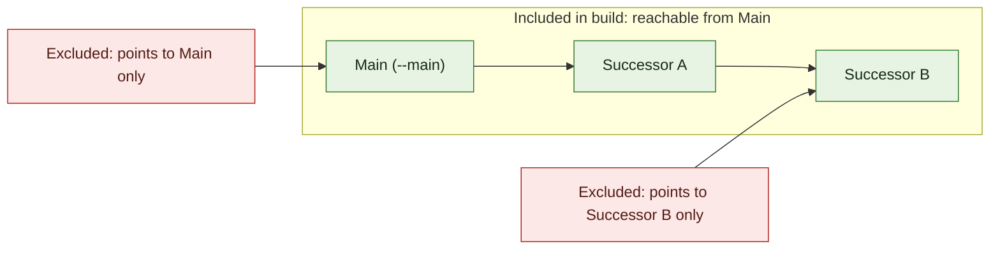

# Anytype Export Viewer

A static site that turns an Anytype markdown export into a properly browsable,
linkable, searchable site — deployable on GitHub Pages for free, so you can
share your notes without inviting anyone into your Anytype space.

It fixes the three things Anytype's own export is missing:

- **Real navigation.** Every link between objects (explicit `Links`/`Backlinks`
  properties *and* plain `[text](file.md)` links inside the body) is resolved
  and turned into a working in-page link — no dead ends.
- **Backlinks that are actually complete.** Backlinks are recomputed from the
  whole export graph at build time, not just read from Anytype's own
  (sometimes stale) `Backlinks` property.
- **Browsing by type and tag, and full-text search**, none of which Anytype's
  export gives you.

## How it works

1. You export a space (or a set of objects) from Anytype as Markdown. That
   gives you a folder of `.md` files, a `schemas/` folder of JSON Schema
   files (one per object type), and a `files/` folder of images/attachments.
2. `node build/build.mjs` reads that folder, resolves every link, and writes
   one `docs/data.json` plus copies the viewer and your asset files into
   `docs/`.
3. `docs/` is a fully static site — GitHub Pages can serve it directly, no
   server or build step needed at request time.

## Setup

```
npm install
```

Put your Anytype export in `content/` (or point the build script at wherever
it lives), then:

```
node build/build.mjs content docs
```

To make a specific object the site's home page, pass its Markdown filename
without `.md` as `--main`. The build includes only objects reachable by
following links outward from that object. Objects outside that subgraph are
omitted from the generated site, including its navigation, search, and
backlinks. Only assets referenced by objects in the subgraph are copied.
`Backlinks` properties are reverse references and do not expand the subgraph.
With type indexes enabled (the default), the indexes remain available and each
lists only reachable objects of that type.

For example, if `main-object` is selected, only `Main`, `A`, and `B` are
included. `Predecessor` and `External` point into the subgraph, but those
incoming links do not make either object reachable from `Main`. A `Backlinks`
property is treated as reverse-reference metadata, not as an outgoing edge:



The included subgraph is formed by repeatedly following outgoing links from
`Main`. Type indexes, search, and navigation use only that same included set.

```
node build/build.mjs content docs --main my-main-object
```

To omit type index pages and use the sidebar for recently visited objects, add
`--no-types`. The home page lists the objects directly, and the sidebar keeps
the last 12 objects visited in that browser:

```
node build/build.mjs content docs --no-types
```

The options can be combined:

```
node build/build.mjs content docs --main my-main-object --no-types
```

Open `docs/index.html` with any static file server to check it locally, e.g.:

```
npx serve docs
```

(Opening `docs/index.html` directly via `file://` won't work — browsers block
`fetch()` of local files. Always use a local server, or GitHub Pages, to view it.)

## Deploying to GitHub Pages

1. Commit `content/`, `build/`, `site/`, `package.json`, and the generated
   `docs/` folder to a GitHub repo (`docs/` is what actually gets served, so
   don't gitignore it).
2. In the repo settings → **Pages**, set the source to **Deploy from a
   branch**, branch `main`, folder `/docs`.
3. Push. Your site is live at `https://<you>.github.io/<repo>/`.

Whenever you re-export from Anytype, drop the new export into `content/`,
re-run the build command, and push again.

### Optional: auto-build on push

If you'd rather not run the build command yourself every time, add
`.github/workflows/build.yml` (not included by default, since it needs your
repo's branch name) that runs `node build/build.mjs content docs` and commits
the result on every push to `content/`. Ask if you want this wired up — it's
a ~15 line GitHub Actions file.

## Folder structure this expects

```
content/
  schemas/
    note.schema.json
    bookmark.schema.json
    ...
  files/
    some-image.jpg
    ...
  my-note.md
  another-object.md
  ...
```

This matches Anytype's own markdown export layout: object files sit flat
alongside `schemas/` and `files/`. The build script actually walks the whole
`content/` tree recursively and matches links by filename, so it tolerates
some structural variation (nested folders, per-type subfolders) — but a flat
export is what's tested and what Anytype produces by default.

**Note on relative asset paths:** frontmatter properties and image embeds
that point at `files/xxx.jpg` are copied through untouched at the same
relative path, so they keep working. If your export nests object files in
subfolders *and* those files reference `files/...` relatively from their own
folder (rather than from the export root), you'll need to adjust the asset
copy step in `build/build.mjs` — flag it and I can adjust.

## What gets rendered from each object type

The build script reads every `schemas/*.schema.json` file Anytype exports and
uses it to decide how to render each property: tags become chips, dates get
formatted, checkboxes become ✓/—, relations become clickable links to the
target object (or a clearly-marked "missing" link if the target wasn't
included in the export), file/image relations render as inline images,
emails/phones/URLs become clickable. Anything not covered by a schema (a
custom relation, or a type with no schema file) still renders, generically.

Broken links (something references a filename that isn't in this export) are
never silently dropped — they render as a dashed "missing" link, and a
`#/diagnostics` page lists every one of them along with what references
them, so you can see at a glance what didn't make it into the export.

## Customizing the look

All styling is in `site/style.css` as CSS custom properties at the top
(`--bg`, `--ink`, `--accent`, fonts, etc.) — change the palette or fonts
there. `site/app.js` has the rendering logic if you want to change how a
particular property format (tag/date/status/etc.) displays.

## Limitations / things to know

- This is intentionally a **read-only viewer** — it doesn't write back to
  Anytype or let you edit objects. It's for sharing, not collaborating.
- Very large exports (many thousands of objects) are bundled into one
  `data.json` fetched once on page load; this is fine up to at least a few
  thousand objects but would need to be split into per-type chunks for a
  huge (10k+) vault. Say the word if you get there.
- Search is a simple client-side title substring match, not full-text — it's
  fast and dependency-free, but won't find a word buried in a note body. If
  you want that, it's a small addition (index the body text too).
