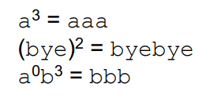

# string   
within the context of computational theory   
given an [alphabet](alphabet.md):   

$$
\epsilon, \text{ is the empty string. } \\ \Sigma^* \text{ is the set of all possible strings over an alphabet } \Sigma 
$$
# functions on strings   
## character count (length)     
the ***length*** of a string *s* is represented as \|*s*\|, which is simply the number of characters/letters in *s*   

$$
\#_x(s), \\ \text{used to denote the number of times x character occurs in a word}
$$
## concatenation   
***concatenation*** is represented through multiplying the string variables (order matters)   
  - if *x = good* and *y = bye*,   
  - then *xy = goodbye*   
  - where the length of a concatenated string is the sum of the its parts   
   
  additionally, given the empty string epsilon, the following would also be true as a reusable identity:   
  
$$
\forall x (x \epsilon = \epsilon x = x)
$$
  > Which explains that for all strings x, concatenating with an empty string will produce just x (representing the property of *closure*)    

  
$$
\forall s, t, w ((st)w = s(tw))

$$
  > showing that *cat* is also *associative*    

  ### the identity element; epsilon   
  *epsilon* (more formally than an empty string) is an identity element/object (string) that leaves another object (character/string) unchanged when an operation between the two is applied.    
    hence in the context of strings within our current work, we directly go to making *epsilon* represent an empty string   
  > *epsilon* than acts like how in finite math, there are identity matrices, or simply the behavior seen when finding the product of any number with 1   

  this is particularly important and can use concatenation to illustrate this:   
    concat is treated as an algebraic operation on strings. where then to treat Sigma\* as a proper algebraic structure, there needs to be the following:   
    - closure   
    - associativity   
    - identity element (what we just covered above)   
  thus in more concise terms, the concat operation is a [monoid](monoid.md) with the additional property of closure when applied over *Sigma\**   
  further details of why this is in [closed operation](closed-operation.md)s   
## repetition (power)   
***repetition: ***which is understand as the power of a string*** **w* such that the following holds   
  
$$
w^0 = \epsilon \\ \text{ and } \\ w^{i + 1} = w^i \cdot w
$$
  for example:   
      
## reverse   
the ***reverse*** of a string can be defined through recursive methods.   
  written as the string to the power R, there are two cases to consider   
  1. base case: empty string.    
      
$$
\text{if } |w| = 0, \text{ then } w^R = w = \epsilon
$$
      thus reversing an empty string yields just the string itself   
  2. recursive case: a non-empty string   
      
$$
\text{if } |w| \ge 1, \text{ then } w = ua
$$
      where *w* can be decomposed into a concatenation of strings *u* and *a*. where the following holds   
      
$$
a \in \Sigma, \text{ has } |a| = 1 \\ u \in \Sigma^* \text{ is a substring (possibly empty)}
$$
      that is, that *a* is a character from the alphabet, while *u* is a sub-string of all possible strings over the same alphabet. allowing empty strings in the process   
      finally, this allows the following to hold (the recursion)   
      
$$
w^R = au^R
$$
   
  in simple terms, it represents a mathematical way of reversing the order of a string given it's not empty   
## combining functions   
### concat and reverse   
with both ***concatenation*** and ***reverse*** strings, the following holds as well   
  
$$
(wr)^R = x^R w^R
$$
  where for example:   
  
$$
(\text{nametag})^R = (\text{tag})^R (\text{name})^R = \text{gateman}
$$
  where the initial concatenation order gets reversed and then the contents of each part gets reversed as well   
# relations on strings    
the ***relation*** on strings is used to show whether one string is a ***substring*** of another. which is what we have been doing already within the earlier sections of the note.    
here are some examples to remember:   
- *aaa* is a ***substring*** of *aaabbbaaa*   
- *aaaaaa* is not a ***substring*** of *aaabbbaaa* (give there isn't enough successive characters to match in the ladder string)   
- *aaa* is a** *proper substring*** of *aaabbbaaa*   
   
two general rules that always hold:   
1. every string is a substring of itself   
2. an empty string is a substring of every string     
   
additonally:   
1. *s* is a ***prefix*** of *t* iff:   
    
$$
\exist x \in \Sigma ^* \space (t = sx)
$$
    and then *s* is a ***proper prefix*** of *t* iff *s* is a prefix of *t* and *s* does not equal *t*   
    > thus a *proper prefix* is a prefix that  is not simply a copy of the original string   

2. *s* is a ***suffix*** of *t* iff:   
    
$$
\exist x \in \Sigma ^* \space (t = xs)
$$
    and *s* is a ***proper suffix*** of *t* iff *s* is a suffix of *t* and *s* is not equal to *t* (similar to a proper prefix)   
